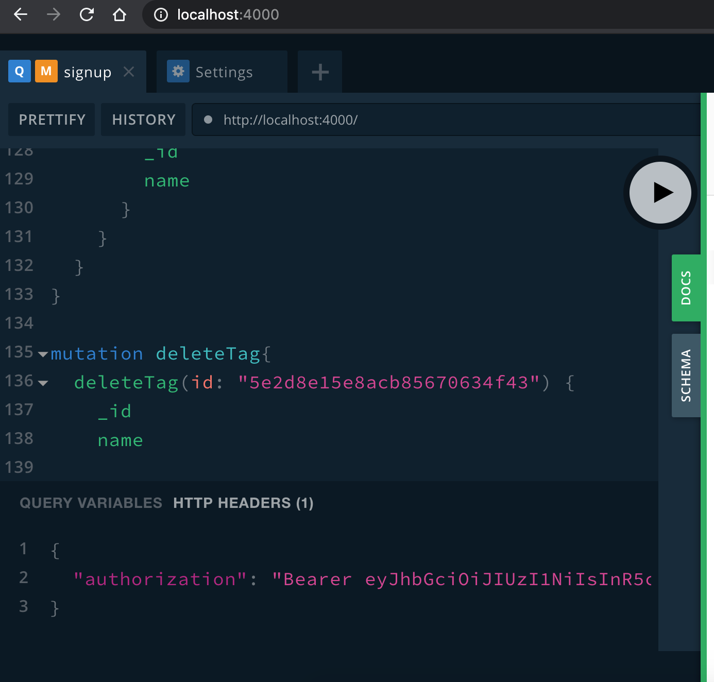

# Setup

Medium like feed with interspersed feed of users and non users using GraphQL, MongoDb and Express.

- By Using GraphQL we are able to use the GraphQL playground for quick testing of API.

- Self documented API in the form of mutation and queries are available


## Steps to start

Install mongodb and node.

1. `npm install`
2. update `MONGODB_URI` in `src/config.js` as per your local mongo setup
3. `npm run start`
4. visit `http://localhost:4000/` to access all the GraphQL api

## Available GraphQL APIs

To use API follow these steps:

1. Generate Token using `signup` or `login` mutations
2. Set `Authorization` header with `Basic <your-auth-token>` in the HEADER section as shown below:




1. Start using below APIs


### Queries

```graphql
  "fetch list of all users"
  users: [User!]!

  "fetch list of all posts author by logged in user"
  myPosts: [Post!]!

  "fetch list of all posts"
  posts(cursor: CursorInput): PostsPayload!

  "fetch current user"
  tags: [Tag!]!

  "fetch information about logged in user"
  me: User!
```

### Mutations

```graphql
  "Register new user using `username` and `password`"
  signup(username: String!, password: String!): UserAuth!

  "Authenticate user to generate login token"
  login(username: String!, password: String!): UserAuth!

  "creates new post using `CreatePostInput`"
  createPost(data: CreatePostInput!): Post!

  "deletes existing post"
  deletePost(id: ID!): Post!

  "updates existing post"
  updatePost(id: ID!, data: UpdatePostInput!): Post!

  "creates new tag using `CreatePostInput`"
  createTag(data: CreateTagInput!): Tag!

  "deletes existing tag"
  deleteTag(id: ID!): Tag!

  "follow a tag"
  followTag(tagId: ID!): User

  "unfollow a tag"
  unFollowTag(tagId: ID!): User

  "follow an author"
  followAuthor(userId: ID!): User

  "unfollow an author"
  unFollowAuthor(userId: ID!): User
```


Features

1. Authenticated users can post content [User Post].

2. There are also special posts by Medium.com’s community managers [non-User Post]. Let’s say there are 2 types of non-User Posts – Type A and B.

3. Each post can have 0 or more tags.

4. While publishing a Post, the user can choose from a global pool of tags or add new ones.

5. A User can “follow” other users, as well tags.

6. My feed should show posts by users I follow, and also posts associated with tags I follow.

7. The feed should be interspersed with non-User Posts. The sequence of posts should satisfy the following rules:

8. Posts should be sorted by recency, and displayed in batches of 10 (via pagination or infinite scrolling)


